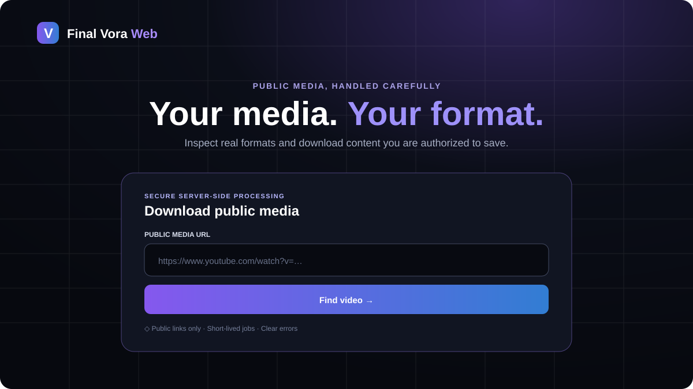

# Final Vora Web

A polished browser application for inspecting and downloading **public media the user owns or is authorized to save**. Final Vora Web combines a Next.js interface with a real `yt-dlp`/FFmpeg backend, short-lived opaque download jobs, visible merge progress, and honest privacy and platform limitations.

[](https://render.com/deploy?repo=https://github.com/Uzair-khan-Me/Final-Vora-Web)



- **Repository:** <https://github.com/Uzair-khan-Me/Final-Vora-Web>
- **Android APK (kept in the original project):** <https://github.com/Uzair-khan-Me/Final-Vora/releases/download/Android/Final.Vora.apk>
- **Developer:** [Uzair Khan](https://github.com/Uzair-khan-Me)

## What is included

- Responsive dark-first product site with downloader above the fold
- Immediate loading, skeleton, progress, success, cancellation, and friendly error states
- Metadata preview: thumbnail, title, creator, duration, source, quality, type, estimated size, audio-only choices
- Direct streaming for progressive/audio formats and FFmpeg preparation for split video/audio
- Public-link guides for YouTube, TikTok, Instagram, and Facebook
- Help, privacy, terms, about, custom 404, Android callout, and responsible-use content
- App Router, strict TypeScript, React, Tailwind CSS 4, server components by default
- Current pinned Next.js/React dependency tree and zero production audit findings at release time
- Technical SEO: unique metadata/canonicals, sitemap, robots, manifest, social image, icons, breadcrumbs, internal links, and truthful JSON-LD
- Accessible landmarks, labels, ARIA live feedback, keyboard focus, large touch targets, contrast, and reduced motion
- Real Node.js child-process boundary around current `yt-dlp`, FFmpeg, and Node.js EJS runtime
- Docker, Render Blueprint, CI, Dependabot, Vitest suite, security policy, hosting/SEO research, and deployment guides

## Supported sources and limitations

Support is **best-effort** and follows the installed `yt-dlp` release. Common public links include YouTube and Shorts, TikTok, Instagram, Facebook, X/Twitter, Vimeo, Reddit, direct public media URLs, and many other compatible sources.

This is not universal support. A download can fail because media is private, DRM-protected, removed, live, login/age restricted, region restricted, missing a compatible format, or changed by the source platform. Hosting-provider/datacenter IPs are often challenged by YouTube. Cookies or an outbound proxy may help an authorized operator in some cases, but do not guarantee success.

The application does **not** bypass DRM, private-video protection, paid access, authentication, or regional controls. Playlists and live streams are disabled. Users must download only content they own, public-domain media, or material they have permission to save while respecting copyright and platform terms.

## Architecture

```text
Browser
  │ POST /api/info { url }
  ▼
URL/DNS/SSRF validation ── rate + concurrency gate
  │ spawn (no shell; fixed args)
  ▼
yt-dlp metadata ── normalize + format allowlist
  │
  ├─ opaque analysis ID → bounded in-memory TTL store
  │
  │ POST /api/download { analysis ID, opaque format ID }
  ▼
one-time download job
  ├─ progressive/audio → GET opaque ticket → yt-dlp stdout → browser
  └─ split streams → unique /tmp dir → yt-dlp + FFmpeg → poll progress
                                           │
                                           └→ one-time file stream → cleanup
```

The original URL is sent in a JSON POST body and is not exposed in public GET query strings. Browser format IDs are random references to server-held, extractor-generated IDs. Visitors cannot supply `yt-dlp` expressions or options.

The in-memory job and rate-limit stores are intentionally scoped to one free container. For multiple replicas, use Redis/shared state and a carefully bounded object store.

## Privacy behavior

Links are sent to the Final Vora Web server. The server contacts the source platform for metadata and media. Direct downloads pass through the server; separate streams can be temporarily stored and merged. Temporary files are deleted after completion, failure, cancellation, or expiry. The app needs no account and does not maintain permanent download history.

That does **not** mean “no logs.” Hosting providers, reverse proxies, operating systems, DNS, and security services can create access/operational logs. Operators should avoid body logging, redact URLs, and keep short retention. If a proxy is configured, its provider can observe outbound traffic. HTTPS thumbnails are loaded directly from their source host in the browser.

Read the complete [privacy explanation](https://github.com/Uzair-khan-Me/Final-Vora-Web/blob/main/app/privacy/page.tsx) and [security policy](SECURITY.md).

## Local development

### Prerequisites

- Node.js 22+ (the production image pins Node.js 24)
- npm 10+
- Python 3.10+ and current `yt-dlp[default]`
- FFmpeg/ffprobe on `PATH`
- Node.js 22+ as the JavaScript runtime used by `yt-dlp-ejs`

Install tools using your operating system’s trusted package manager. For Python environments:

```bash
python3 -m venv .venv
. .venv/bin/activate
pip install 'yt-dlp[default]==2026.7.4'
```

Then:

```bash
cp .env.example .env.local
npm ci
npm run dev
```

Open <http://localhost:3000>. The dev server binds to `0.0.0.0` and `next.config.ts` allows Arena’s proxied `*.e2b.app` dev origins so client bundles and the Find Video action load in Live Preview.

Check tools:

```bash
curl http://localhost:3000/api/health
```

Automated tests never require a live YouTube request; they use mocks/fake executables.

## Environment variables

| Variable | Default | Purpose |
|---|---:|---|
| `NEXT_PUBLIC_SITE_URL` | `https://final-vora-web.onrender.com` | Canonical HTTPS origin for metadata, sitemap, robots, and JSON-LD. Set at build time. |
| `YT_DLP_PATH` | `yt-dlp` | Executable name or absolute path. Not visitor-controlled. |
| `YT_DLP_PROXY` | empty | Optional operator-managed proxy URL. Treat credentials as secrets. |
| `YT_DLP_COOKIES` | empty | Absolute path to a mounted Netscape-format cookie file. Never cookie contents. |
| `DOWNLOAD_MAX_DURATION` | `7200` | Maximum source duration in seconds. |
| `DOWNLOAD_MAX_CONCURRENT` | `2` | Shared extraction/download child-process limit. Use 1 on small hosts. |
| `DOWNLOAD_JOB_TTL` | `600` | Analysis/file ticket lifetime in seconds. |
| `DOWNLOAD_MAX_JOBS` | `300` | Maximum bounded in-memory job count. |
| `DOWNLOAD_MAX_FILE_MB` | `250` | Per-file/source transfer cap. |
| `EXTRACTION_TIMEOUT_SECONDS` | `45` | Hard metadata-process timeout. |
| `DOWNLOAD_TIMEOUT_SECONDS` | `600` | Hard download/merge-process timeout. |
| `RATE_LIMIT_MAX` | `20` | Per-IP API requests in one window. |
| `RATE_LIMIT_WINDOW` | `60` | In-memory rate window in seconds. |
| `DOWNLOAD_TEMP_DIR` | OS temp directory | Unique merge directories root. |
| `PORT` | `3000` | HTTP port; Render injects this. |

See [.env.example](.env.example). Never commit `.env` files, Netscape cookies, proxy credentials, downloaded media, tokens, or private links.

### Cookies and proxies

Cookies are optional and operator-only. Export an authorized account’s cookies in Netscape cookie-file format, store the file outside Git with restrictive permissions, mount it read-only, and point `YT_DLP_COOKIES` to the mounted path. Never paste cookies into an issue, Dockerfile, image layer, environment variable, or log. Cookie use must comply with the source platform and must not be used to relay private/paid content.

A proxy is configured with `YT_DLP_PROXY` as a deployment secret. The proxy operator can observe traffic metadata and destinations. Do not disable TLS verification. Proxying does not make prohibited use acceptable.

## Docker

Build and run the exact production shape:

```bash
docker build --pull \
  --build-arg NEXT_PUBLIC_SITE_URL=https://downloads.example.com \
  -t final-vora-web .
docker run --rm \
  -p 3000:3000 \
  --read-only \
  --tmpfs /tmp:rw,noexec,nosuid,size=1g,uid=1001,gid=1001 \
  --env-file .env.local \
  final-vora-web
```

The multi-stage AMD64/ARM64 image uses a current supported Node.js base, builds Next.js standalone output, installs pinned `yt-dlp[default]`, FFmpeg, CA certificates, Python, and uses Node as the EJS runtime. It runs as UID 1001, writes media only under ephemeral `/tmp`, and has a health check. Secrets are excluded from the strict build context.

## Deploy to Render

Use the button above or create a Blueprint from `render.yaml`.

1. Connect `Uzair-khan-Me/Final-Vora-Web` (or your fork).
2. Review the Docker web service and Free plan.
3. Set `NEXT_PUBLIC_SITE_URL` to the final HTTPS origin and rebuild.
4. Optionally add secret `YT_DLP_PROXY`; mount cookies as a secret file and set only its path.
5. Deploy and verify `/api/health` reports both tools available.
6. Analyze a small permitted public link and confirm private URLs return `PRIVATE_URL`.

Render’s free service has 0.1 CPU/512 MB RAM, sleeps after 15 idle minutes, takes around a minute to wake, uses an ephemeral filesystem, and can restart at any time. As researched on 19 August 2026, new Hobby workspaces include 5 GB outbound/month. Video relay traffic can exhaust that very quickly. Render hosting also does not guarantee YouTube will accept its datacenter IP.

## Oracle Cloud summary

An Always Free-eligible Ampere A1 VM is the strongest researched free-resource option when capacity is available: run the ARM64 Docker image behind Caddy/nginx, expose only HTTPS, keep the app on loopback, mount `/tmp` with a hard size, monitor egress/disk/children, patch monthly, and publish an abuse contact. Oracle account/payment verification can be required, A1 capacity can be unavailable, and idle instances can be reclaimed.

Full instructions for Oracle, Cloud Run, Render, and a generic VPS are in [docs/DEPLOYMENT.md](docs/DEPLOYMENT.md). Current provider comparison and official sources are in [docs/HOSTING_RESEARCH.md](docs/HOSTING_RESEARCH.md).

## Testing and quality checks

```bash
npm ci
npm run typecheck
npm run lint
npm test
npm run build
npm audit --omit=dev
git diff --check
docker build -t final-vora-web:test .
```

Tests cover public/private IPv4 and IPv6 URL handling, cloud metadata, DNS failure, malformed/oversized input, format injection, path traversal, API content type/body/rate limits, stable errors, child timeout/cancellation, metadata normalization, fake `yt-dlp`, safe download headers, temporary cleanup, and interactive loading/error UI.

A complete GitHub Actions workflow template is included at `.github/ci.workflow.yml`. Move it to `.github/workflows/ci.yml` after authorizing workflow-file writes; it runs type checking, lint, tests, production build, dependency audit, whitespace validation, and a Docker build on pushes and pull requests.

## Troubleshooting

| Symptom | Likely cause | Action |
|---|---|---|
| Find Video appears unresponsive | JavaScript blocked, stale bundle, extension, or preview origin blocked | Reload, disable the blocking extension for the site, inspect browser console/network. Arena requires `allowedDevOrigins: ['*.e2b.app']`, already set here. |
| Arena preview JavaScript blocked | Next dev-origin protection | Confirm the preview uses this repo’s `next.config.ts`, restart dev server, and check there are no cross-origin asset warnings. |
| `ENGINE_MISSING` / `yt-dlp` missing | Binary absent or wrong `YT_DLP_PATH` | Install current `yt-dlp[default]`, set the executable path, and check `/api/health`. |
| `FFMPEG_MISSING` | FFmpeg/ffprobe absent | Install FFmpeg binaries (not a similarly named language package) and restart. |
| TLS/network failure | Egress firewall, DNS, CA, provider outage, sandbox TLS limit | Verify outbound HTTPS/CA certificates. Retry outside the sandbox. Never disable certificate verification. |
| YouTube bot verification | Hosting/datacenter IP challenged | Wait; use a permitted operator cookie/proxy if appropriate; try another host. It is not necessarily an app bug. |
| Cookies required | Public source needs an authenticated extractor session | Operator may mount an authorized Netscape cookie file. Visitors cannot upload one. Private/paid media remains unsupported. |
| No compatible progressive formats | Source exposes only unsupported/protected/split choices or changed | Re-analyze, choose an offered merged option, update `yt-dlp`, or use another authorized source. |
| Download stops midway | Client disconnected, source expired, host restarted, timeout/size limit | Use a smaller direct format, keep the tab/network active, inspect stable error/logs, review limits. |
| Free service sleeping | Render/Koyeb scale-to-zero | Wait for cold start, then analyze again; old in-memory jobs do not survive sleep. |
| Bandwidth exhausted | Video responses consumed monthly egress | Stop public traffic, review provider usage, lower size/rate limits, or move to a budgeted host. |
| Temporary disk full | Concurrent split streams exceed ephemeral space | Reduce concurrency/file limit, increase bounded temp space, and confirm cleanup permissions. |
| Source platform changed | Extractor no longer matches current site behavior | Update pinned `yt-dlp` after reviewing release notes and rebuild; do not weaken security/TLS. |

## Security and abuse controls

- SSRF checks for protocol, credentials, port, local/internal names, DNS, IPv4/IPv6 private/link-local/reserved/metadata targets
- JSON/content-length/URL limits and no wildcard CORS
- no shell, no visitor-provided options, bounded stdout/stderr, hard timeouts, disconnect cleanup
- opaque TTL IDs, exact server format allowlist, one-time tickets, bounded stores
- rate/concurrency/duration/filesize/job limits
- unique temp directories, non-root image, safe filenames/headers/MIME, no-store download/API caching
- CSP, frame protection, `nosniff`, referrer/permissions policies

DNS preflight cannot fully prevent every rebinding/redirect inside a complex third-party extractor. A high-risk production deployment should also enforce private-network blocks at an outbound firewall/proxy and require authentication. See [SECURITY.md](SECURITY.md).

## SEO and accessibility

See [docs/SEO.md](docs/SEO.md) for intent mapping, unique metadata, internal linking, structured data, Core Web Vitals considerations, official sources, and the production-domain checklist. No fake reviews, ratings, users, download totals, or universal-support claims are used.

## License

[MIT](LICENSE). The license covers this project’s source code; it does not grant rights to media obtained through a deployment or to third-party platform trademarks/content.
